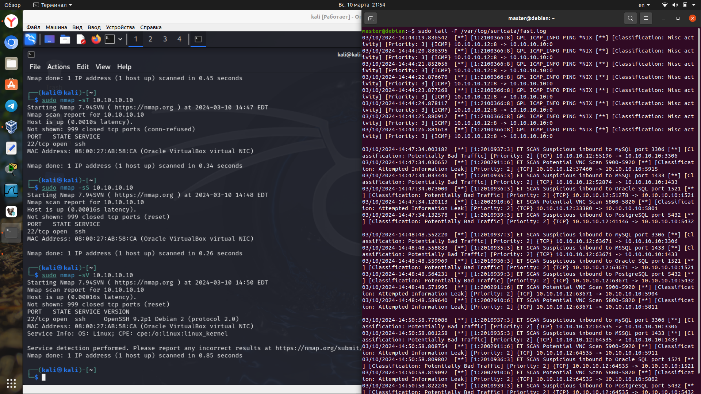
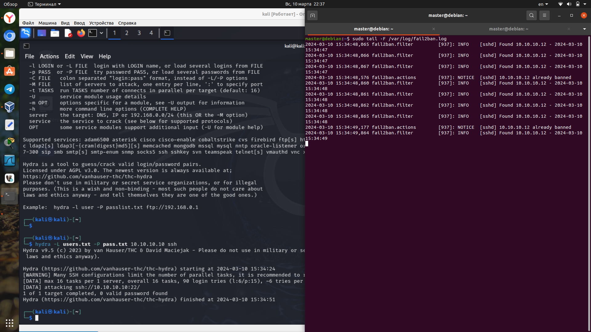

# Домашнее задание к занятию "`Защита сети`" - `Аблогин Павел`

---

### Задание 1

1. `Установил и настроил suricata`
2. `Выполнил сетевое сканирование защищаемого хоста с помощью nmap`
3. `Сканирование с опцией -sA в логе suricata не зафиксировалось, сканирование с опциями -sT, -sS, -sV попало в лог`

`Скриншот выполнения задания 1`
`

---

### Задание 2

1. `Установил и настроил fail2ban`
2. `Подготовил словари с именами пользователей и паролями`
3. `Выполнил подбор паролей на хосте`
4. `Подбор паролей зафиксировался в логе fail2ban и suricata`

`Скриншот выполнения задания 2`
`

---
